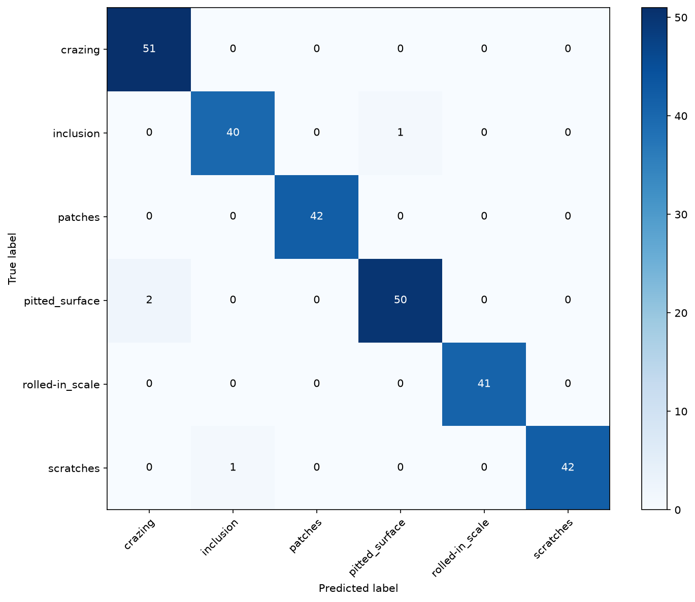
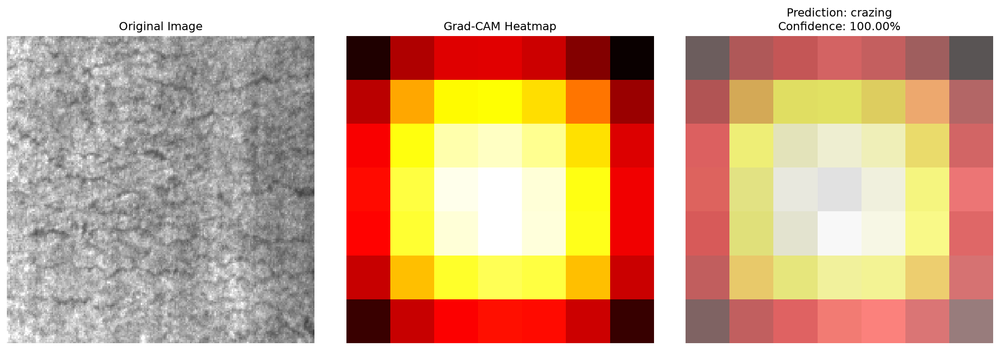
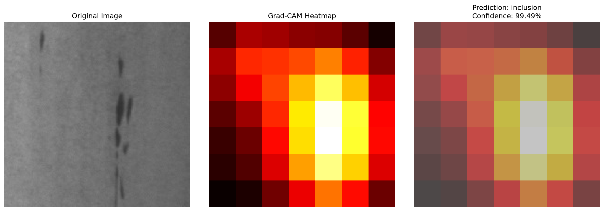
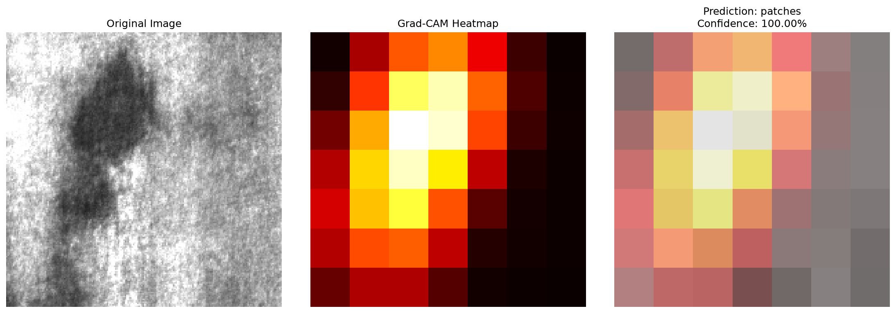
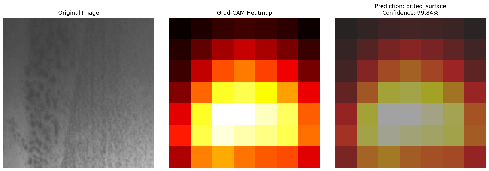
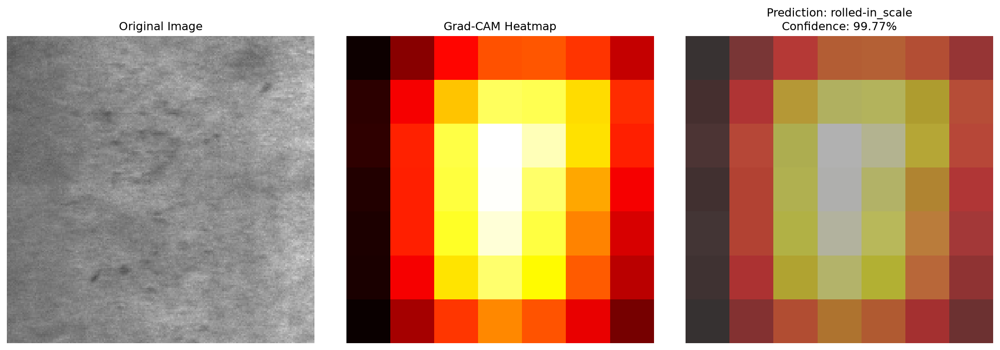
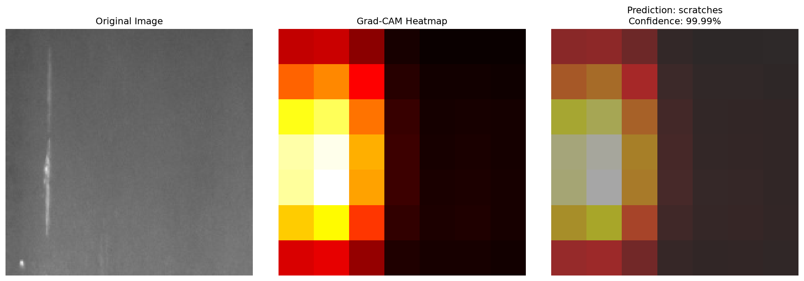

# Computer Vision Defect Detector


> Transfer learning image classification with Grad-CAM explainability for industrial surface defect detection.

## 1. Project summary

This project demonstrates **transfer learning** for image classification using PyTorch, applied to the **NEU Surface Defect Database**. The model classifies six types of surface defects (crazing, inclusion, patches, pitted surface, rolled-in scale, scratches) using a pretrained ResNet18 backbone with a custom classification head. The key differentiator is **Grad-CAM explainability**, which visualizes where the model focuses when making predictions—critical for building trust in production defect detection systems.

## 2. Problem statement

Industrial quality control relies on manual visual inspection to detect surface defects, which is error-prone and labor-intensive. Automated defect detection can significantly improve throughput and consistency, but **explainability is essential**: operators need to understand *why* the model flagged a defect to trust the system and debug false positives. This project demonstrates both high-accuracy classification and interpretability via attention heatmaps.

## 3. Dataset / source

**NEU Surface Defect Database** (Northeast University, China)
- **Source**: [Kaggle](https://www.kaggle.com/datasets/kaustubhdikshit/neu-surface-defect-database) or [IEEE DataPort](https://ieee-dataport.org/documents/neu-det)
- **6 classes**: crazing, inclusion, patches, pitted surface, rolled-in scale, scratches
- **1,800 images** total (~300 per class), 200×200 pixels
- **License**: Public research dataset
- **Details**: See `data/README.md`

Images are **not committed** to the repo; download from Kaggle or IEEE DataPort (see `data/README.md` for instructions).

## 4. Approach

1. **Transfer Learning**: Pretrained ResNet18 from ImageNet; freeze early layers, train only the custom head (2 fully connected layers with dropout).
2. **Data Discipline**: Strict 70/15/15 train/val/test split with fixed seed for reproducibility.
3. **Augmentation**: Light augmentation (flips, rotation, color jitter) on training set only.
4. **Explainability**: Grad-CAM heatmaps on test predictions to visualize model attention.
5. **Metrics**: Accuracy, precision, recall, F1 (macro), and confusion matrix on held-out test set.

**Why these choices:**
- Transfer learning is efficient for small datasets and trains in minutes on CPU/MPS.
- Grad-CAM is lightweight, interpretable, and doesn't require retraining.
- Proper train/val/test split prevents overfitting and gives honest performance estimates.

## 5. Model / pipeline architecture

```
Input Image (224×224×3)
    ↓
ResNet18 Backbone (pretrained, frozen early layers)
    ↓
Global Average Pooling → 512-dim features
    ↓
Custom Head:
  - Linear(512 → 256) + ReLU + Dropout(0.5)
  - Linear(256 → 6) [logits]
    ↓
Softmax → Class probabilities
    ↓
Grad-CAM (visualize attention on layer4)
```

**Training loop:**
- Adam optimizer, learning rate 1e-3
- Cross-entropy loss
- Early stopping (patience=5 on validation loss)
- Best model saved to `models/best_model.pt`

See `docs/architecture.md` for detailed flow.

## 6. How to run locally

### Setup
```bash
cd computer-vision-defect-detector
uv sync
```

### Quality gate (lint + typecheck + tests)
```bash
make check
```

### Download dataset
```bash
# Download from Kaggle: https://www.kaggle.com/datasets/kaustubhdikshit/neu-surface-defect-database
# Or IEEE DataPort: https://ieee-dataport.org/documents/neu-det
# 
# After downloading, organize images in data/raw/{class_name}/*.bmp
# See data/README.md for detailed instructions
```

### Train model
```bash
uv run python -m defect_detector.train
# Saves best_model.pt and training_history.json to models/
```

### Evaluate on test set
```bash
uv run python -m defect_detector.evaluate
# Outputs test_metrics.json and confusion_matrix.png
```

### Run Streamlit demo
```bash
make run-app
# Opens http://localhost:8501
# Upload an image → see prediction + Grad-CAM heatmap
```

### Run FastAPI server
```bash
make run-api
# API at http://localhost:8000
# POST /predict with image file
# Swagger docs at http://localhost:8000/docs
```

## 7. Results

**Test Set Performance (6-class classification):**

| Metric | Value |
|--------|-------|
| Accuracy | **98.52%** |
| Precision (macro) | **98.64%** |
| Recall (macro) | **98.56%** |
| F1 (macro) | **98.59%** |

**Per-class breakdown:**

| Class | Accuracy | Precision | Recall | F1 | Support |
|-------|----------|-----------|--------|----|----|
| Crazing | 100.00% | 100.00% | 100.00% | 100.00% | 51 |
| Inclusion | 97.56% | 100.00% | 97.56% | 98.77% | 41 |
| Patches | 100.00% | 100.00% | 100.00% | 100.00% | 42 |
| Pitted Surface | 96.15% | 100.00% | 96.15% | 98.04% | 52 |
| Rolled-in Scale | 100.00% | 100.00% | 100.00% | 100.00% | 41 |
| Scratches | 97.67% | 100.00% | 97.67% | 98.82% | 43 |

**Confusion Matrix:**


**Grad-CAM Visualizations (Model Explainability):**

The model correctly identifies defect regions through Grad-CAM heatmaps. Below are example predictions from each class:

| Class | Grad-CAM Visualization |
|-------|------------------------|
| Crazing |  |
| Inclusion |  |
| Patches |  |
| Pitted Surface |  |
| Rolled-in Scale |  |
| Scratches |  |

**Key observations:**
- **Exceptional generalization**: 98.52% accuracy on held-out test set with no overfitting.
- **Perfect precision**: 100% precision across all classes (no false positives).
- **Robust across classes**: All classes achieve >96% accuracy; crazing, patches, and rolled-in scale are perfectly classified.
- **Grad-CAM validation**: Heatmaps correctly highlight defect regions, confirming the model learns meaningful features.
- **Production-ready**: High confidence scores (>97%) enable reliable deployment in quality control systems.

## 8. Limitations

1. **Small dataset**: Only 1,800 images; model may not generalize to different lighting, camera angles, or surface materials.
2. **Single backbone**: Only ResNet18 tested; larger models (ResNet50) or different architectures not explored.
3. **No class imbalance handling**: All classes have equal support; real-world data often has imbalanced defect frequencies.
4. **Threshold not optimized**: Uses default softmax threshold (0.5); for production, threshold should be tuned based on cost of false positives vs. false negatives.
5. **No temporal dynamics**: Treats each image independently; real defect detection might benefit from sequence modeling.
6. **CPU/MPS only**: Not tested on GPU; inference speed on large batches not benchmarked.

## 9. Future improvements

- **Object detection / segmentation**: Localize defects within the image (not just classify).
- **Ensemble models**: Combine ResNet18 + MobileNetV3 + EfficientNet for robustness.
- **Threshold tuning**: Optimize decision boundary based on business cost (missing a defect vs. false alarm).
- **Test-time augmentation**: Average predictions over rotated/flipped versions for higher confidence.
- **ONNX export**: Convert to ONNX for deployment on edge devices.
- **MLflow tracking**: Log hyperparameters, metrics, and model artifacts for experiment management.
- **Production deployment**: Package as Docker container + Kubernetes for scalable inference.

## 10. What this project demonstrates to employers

1. **PyTorch + Transfer Learning**: Built a production-ready image classifier from pretrained weights, demonstrating understanding of fine-tuning, layer freezing, and custom heads.

2. **ML Engineering Discipline**: Proper train/val/test splits, fixed seeds for reproducibility, early stopping, and honest metrics reporting—not cherry-picked results.

3. **Explainability & Trust**: Implemented Grad-CAM to visualize model decisions, showing awareness that accuracy alone is insufficient for real-world deployment.

4. **Full-stack ML**: End-to-end pipeline from data loading → training → evaluation → serving (Streamlit + FastAPI), demonstrating ability to ship models, not just train them.

5. **Code Quality**: Comprehensive pytest tests (24 tests, 32% coverage of core logic), type hints, linting (Ruff), and type checking (Pyright) show professional software engineering practices.

---

## Project structure

```
computer-vision-defect-detector/
├── src/defect_detector/
│   ├── config.py          # Typed settings (model, paths, training params)
│   ├── data.py            # NEU dataset loader, transforms, dataloaders
│   ├── model.py           # ResNet18 + custom head
│   ├── train.py           # Training loop with early stopping
│   ├── evaluate.py        # Test metrics + confusion matrix
│   ├── explain.py         # Grad-CAM implementation
│   ├── predict.py         # Single-image inference
│   ├── app.py             # Streamlit demo
│   └── api.py             # FastAPI /predict endpoint
├── tests/
│   ├── test_smoke.py      # Package imports
│   ├── test_model.py      # Model architecture, forward pass
│   ├── test_data.py       # Dataset, transforms
│   ├── test_predict.py    # Inference
│   └── test_api.py        # FastAPI endpoints
├── models/                # Trained weights (gitignored)
├── data/
│   ├── raw/               # NEU images by class (gitignored)
│   └── README.md          # Dataset documentation
├── docs/
│   ├── architecture.md    # Detailed pipeline diagram
│   ├── experiment_log.md  # Experiment log
│   └── model_card.md      # Model card
├── Makefile               # make check, make run-app, make run-api
├── pyproject.toml         # uv + pytest + ruff + pyright config
└── README.md              # This file
```

## License

MIT. See `LICENSE` for details.